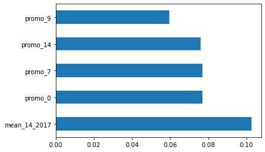

# Corporación Favorita Grocery Sales Forecasting
## By Srujana
### January 11, 2021

[Favorita](https://www.corporacionfavorita.com/en/) is one of the major grocery chains in Ecuador, South America. In this [Kaggle](https://www.kaggle.com/c/favorita-grocery-sales-forecasting/data) competition we will be predicting the unit sales for thousands of items sold at different Favorita stores located in Ecuador. 
This project contains six files ( Train, Test, Item, Stores, Oil, Transactions and Holiday_events ) needed for predicting unit sales for different products from 16 August 2017 to 31 August 2017. 

## Main Results

The top 5 features used for predicting unit sales are average sales calculated to next two weeks for each date in train and validation data, promotions calculated for future days tells about whether the item will be on promotion or not for coming days played an important role for forecasting sales in test data. 

## References

Data Source[https://www.kaggle.com/c/favorita-grocery-sales-forecasting/data]

https://www.kaggle.com/aharless/dissecting-ceshine-lee-s-lgbm-kernel 

https://www.kaggle.com/sohinibhattacharya86/predict-grocery-sales-rf-xgb  

## Analysis
:arrow_right: Analyzed the six data files and plotted insights from them to understand the relations between target variable and other variables
:arrow_right: Modeled Random forest regressor and Randomized Search CV models on train and test data

**Evaluation Metrics**

Random Forest Regressor | Randomized Search CV
----------------------- | ---------------------
MAE  :   0.29           |  MAE  :   0.28 
MSE  :   0.40           |  MSE  :   0.35 
RMSE :   0.63           |  RMSE :   0.59

